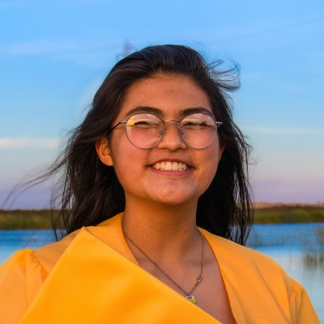
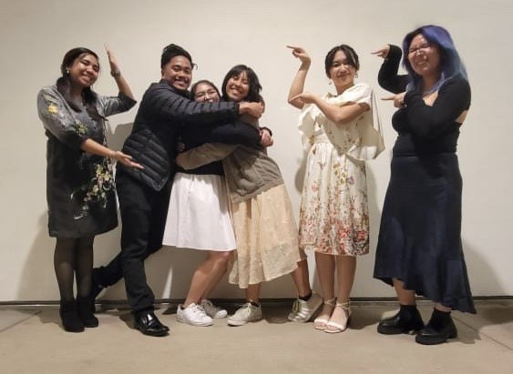
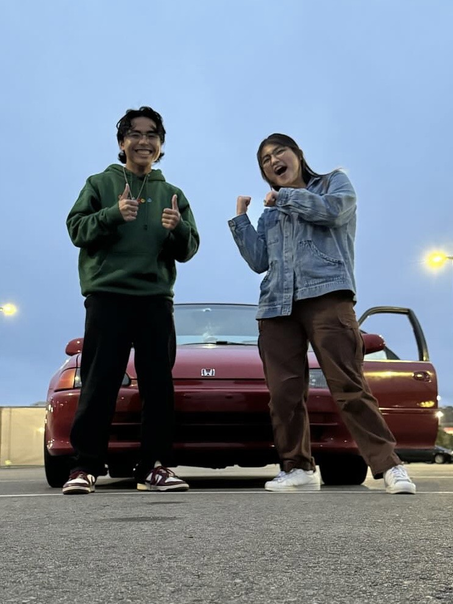
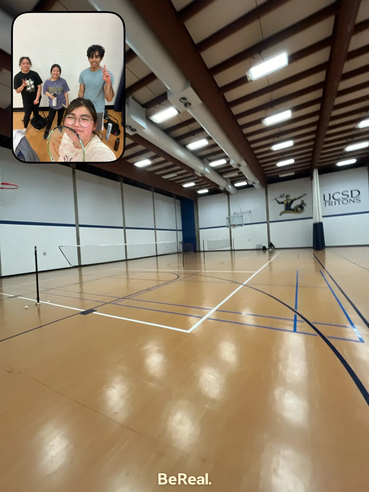
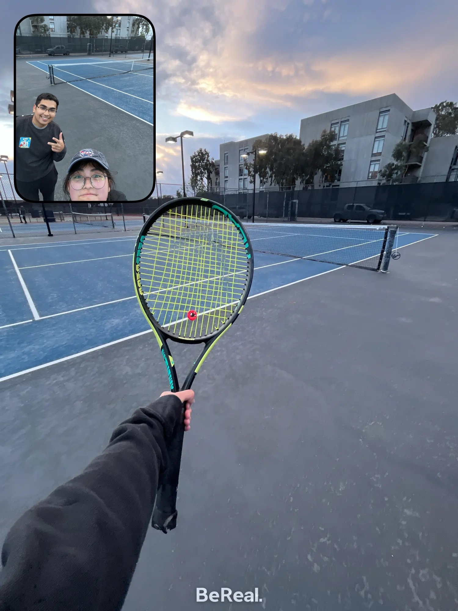
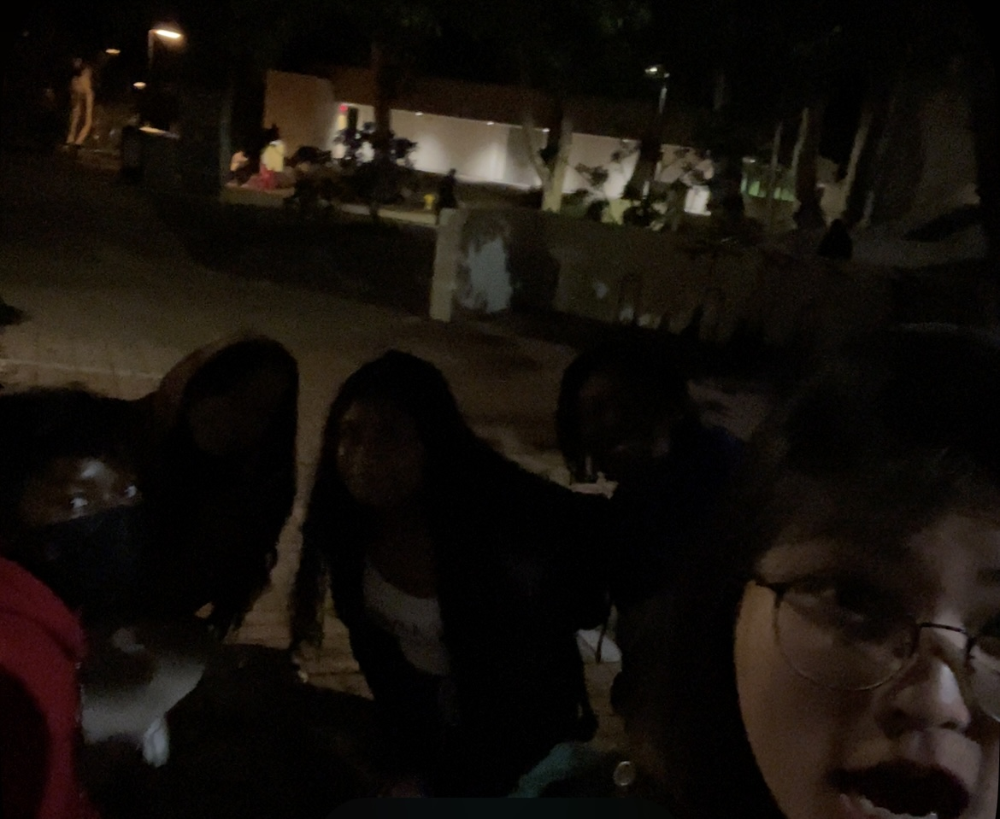
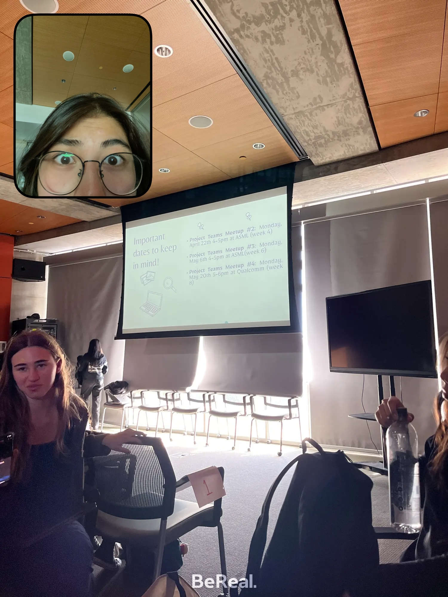
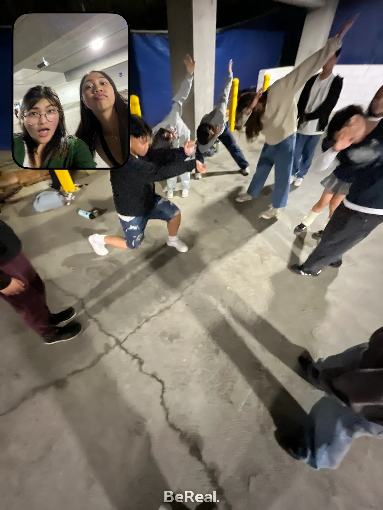
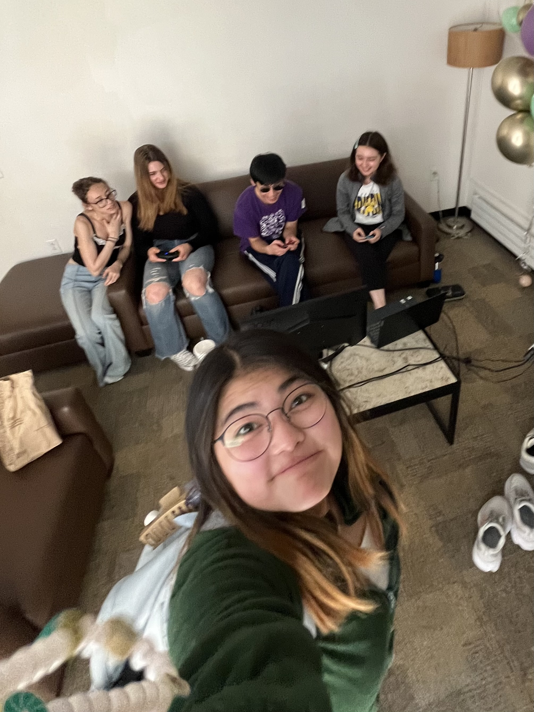
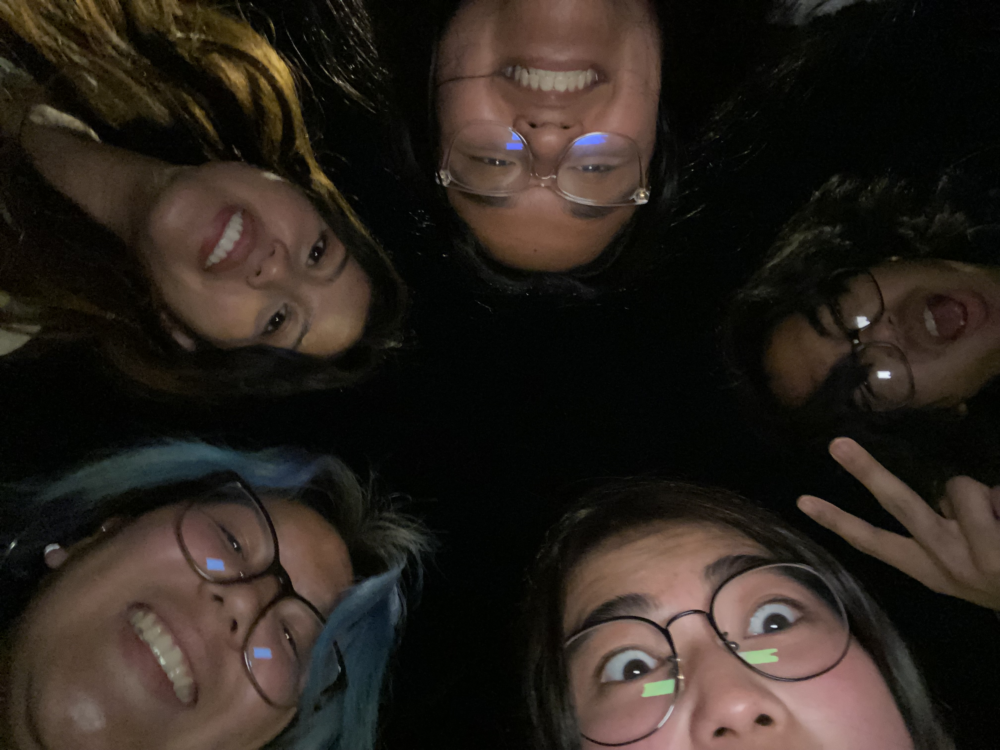

# CSE110 Lab 1
## My User Page: Nicole Go

### **About me as a Student and Programmer**

Hello! I am Nicole Go (she/her), a new student in CSE110. I am looking forward to this class and learning from you as our instructor! I'm currently a sophomore in Eleanor Roosevelt College majoring in Computer Science looking to double major in psychology (focus on cognitive psychology). I would say that a strength I have is my creativity, persistance, and soft skills such as communication. However, a weakness is my indecisiveness and perfectionism, and so I remind myself of the following quote all the time. 
> You are doing a greater disservice to yourself by being indecisive rather than making the wrong decision 

For my first project, I made an animated Christmas background with the help of my brother using HTML.
Here is a link to get an idea of what it looked like!
[Christmas Background](christmas-background.html)

I also made a flashcards app using React, which uses psychological techniques to help the user learn. Here is a portion of the code that I learned from a course about forms as a component. 
'''
import React, { useState } from "react";

import "./ExpenseForm.css";

const CardForm = (props) => {
    const [enteredQuestion, setEnteredQuestion] = useState('');
    const [enteredAnswer, setEnteredAnswer] = useState('');

    const questionChangeHandler = (event) => {
        setEnteredQuestion(event.target.value);
    };

    const answerChangeHandler = (event) => {
        setEnteredAnswer(event.target.value);
    };

    const submitHandler = (event) => {
        event.preventDefault();

        const cardData = {
            question: enteredQuestion,
            answer: enteredAnswer
        };
        props.onPassCardData(cardData);
        setEnteredQuestion('');
        setEnteredAnswer('');
    };

  return (
    <form onSubmit={submitHandler}>
      

        

          <label>Question</label>
          <input 
            type='text' 
            value={enteredTitle} 
            onChange={questionChangeHandler} 
          />
        

        

          <label>Answer</label>
          <input 
            type='text' 
            value={enteredTitle}
            onChange={answerChangeHandler}
          />
        

      

      

        <button type='submit'>Add Card</button>
      

    </form>
  );
};
export default ExpenseForm;
'''
Here is a link to my GitHub repository for this personal project!: [Flashcards Project](https://github.com/nicole-beatrice-go/Stoodi-App)

Finally, I worked a summer internship at WITNESS to Mass Incarceration, an organization that promotes businesses of the formerly incarcerated, as a Website and Mobile App Developer. I'm also currently a tutor for algebra and Python!

### **My Goals for CSE110**
These are some of my goals in CSE110:
- [ ] Improve my teamwork skills when it comes to software engineering 
- [ ] Hone my JavaScript
- [ ] Learn more about how to layout a project the way I intend to visually
- [ ] Focus on my technical skills

### **My Goals for the Future and my Career**
These are some ideas I had for my career:
* Work in Human Factors Engineering (seeing what website layout/function works best for human understanding) 
* Work on Front-End and focus on layout
* Specialize in UX/UI
* Combine computer science and software engineering with cognitive psychology/science to make products that are aesthetically pleasing and have a human-friendly functionality and layout
* Maybe make my own app someday and know what it's like running a start-up
* Create products dedicated to the user experience in terms of functionality and layout

### **Other Fun I Do!**
Here are some clubs I am a part of and some projects/positions I do for each!:
1. Women in Computing
   - Project Teams: creating a website with our chosen theme/idea with 5-6 other people
2. Filipino Club (Kaibigano Pilipino):
   - Kuya-Ate-Ading: a part of a fam!
   - Peer Counselors (have a mentor in college and aim to become one)
   - Pilipino Cultural Celebration (PCC): acting, singing, and dancing surrounding Filipino culture for a show
3. Comfort Tone (acapella)
4. Badminton
5. Social Tennis

These are some images of me and my clubs!:

Here are also some hobbies I do!:
1. Anything crafty (origami, embroidery, journaling)
2. Puzzles
3. Martial arts
4. Playing ping pong or watching movies with my family
5. The performing arts (singing, acting, dancing)
6. Thrill-seeking like riding rollercoasters
7. Hanging out with friends and roommates (spontaneous adventures!).

Here are links (relative links) to the other part of this lab, my screenshots:
[Link to Screenshot of Command Line]()
[Link to Screenshot of VS UI]()